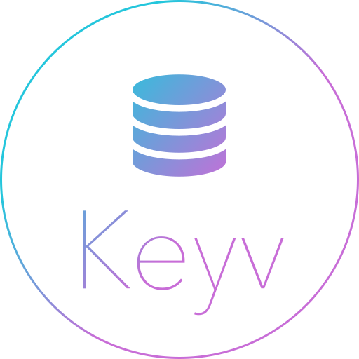

[](https://github.com/howlowck/keyv-azuretable)

# Keyv-AzureTable

## Install

`npm install keyv-azuretable`

## Usage


```js
const Keyv = require('keyv');
const KeyvAzureTable = require('keyv-azuretable');

const azTableConnectionStr = '' // connection string for your table
const noNsAzTable = new KeyvAzureTable(azTableConnectionStr);
const keyv = new Keyv(usersAzTable);
// userAzTable = {store: azTableAdatpr, namespace: `keyvns-${nanoid()}`}

const usersAzTable = new KeyvAzureTable(azTableConnectionStr, { namespace: 'users' });
// userAzTable = {store: azTableAdapter, namespace: 'users'}
const usersKeyv = new Keyv(usersAzTable);

//set
await keyv.set("foo", "bar", 6000) //Expiring time is optional

//get
let obj = await keyv.get("foo");

//delete
await keyv.delete("foo");

//clear
await keyv.clear();

```
